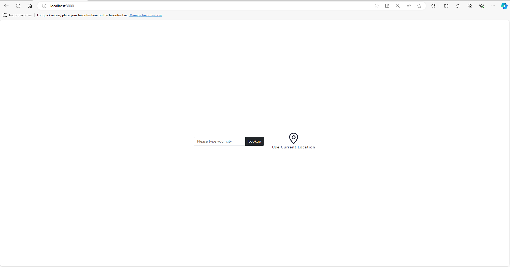
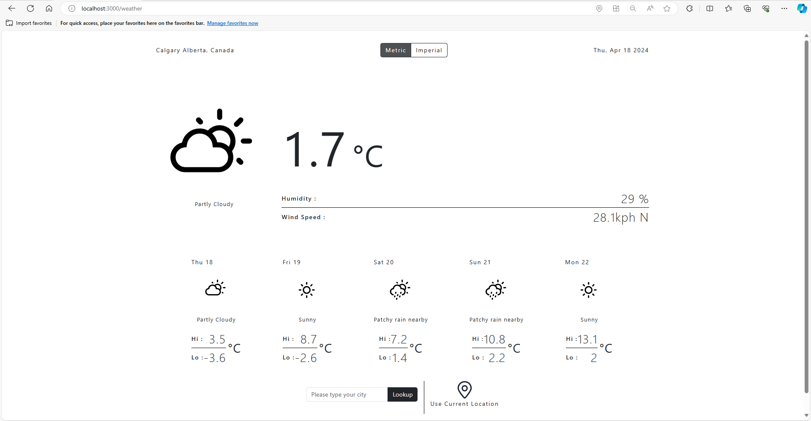
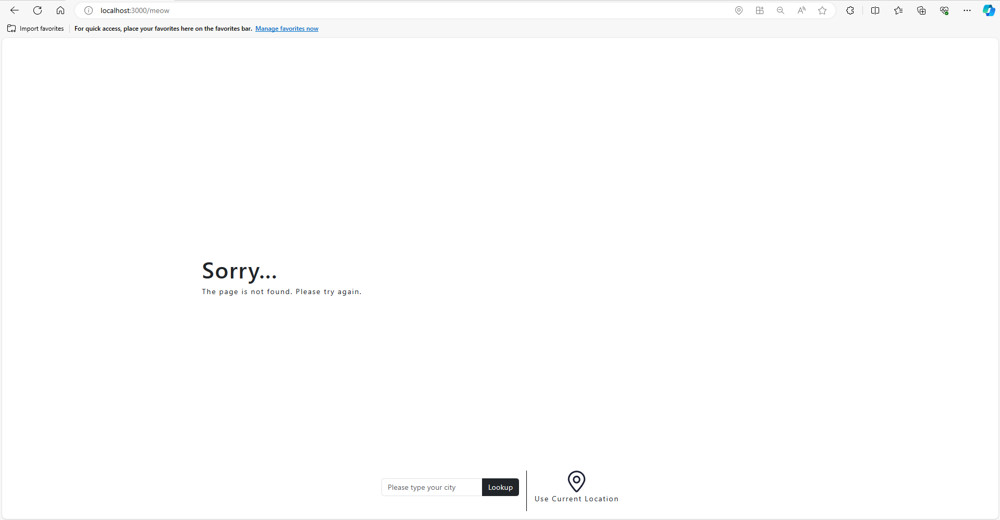

# Weather Dashboard

## How to run this?

1. First, plase make sure you have the `.env` file in the root folder.

2. install npm packages by running

```
npm i
```

3. To running locally please run following command

```
npm run start
```

## Tech choices

- weather API: https://www.weatherapi.com/

  - reason: I can send either city or geo coordinates for requests and it can help reduce API calls compared with OpenWeather; the weather API can return up to 8 days forecast whereas the openWeather can return only 4 days for the free tier.
  - possible weateher status: https://www.weatherapi.com/docs/weather_conditions.json

- Lineicons: https://lineicons.com/free-icons/weather-icons

  - the weather Icon svg; there weren't all 48 kinds but I could map a decent amount of them. I had to reuse some of the icons

- react-geolocated: https://www.npmjs.com/package/react-geolocated

  - NPM package that take device geo location

- react-router-dom: https://www.npmjs.com/package/react-router-dom

  - routering in the app

- date-and-time: https://www.npmjs.com/package/date-and-time
  - I thought I could make my own but since somebody has already made it, why not leverage them?

## Project structure

The most contents except weather icons are located in `src` folder.

```
- /public
  - /weather-icons : all the weather icons go for easy access across the app
- /src
  - /__mocks__ : mock json files
  - /assets : All other assets
  - /components : react components; explain below
  - /Providers : weather, location and status providers
  - /reducers  : reducer files; explain below
  - /utils : commonly used function in the utils
  - /const : constant label string
  - /.env : API key and API URL: I will email you this file
```

### components

There are three different types of components in the folder.

- container component: `fullScreenPage`, `layoutContainer`
  - It contains general layouts
- page component: `weatherPage`
  - It is a page-specific component; it also directs children of a container component
- sub-components: all others
  - the components are reusable at any time.

### .env

I usually store sensitive information in the .env file so that it will not upload to github.
I will share it with you when I submit the code challenge to git via email.

### Design choice

I pick a minimalistic design for this project.

#### Landing page

The page shows only search bar and geo location button.
The search bar also have a functionality to auto suggest as you type the city.


#### Dashboard page

The dashboard screen has a minimalistic design.
It is easier for users to find the information they need.

I put a search component on the bottom of the page so that a user can try
another city.



#### Error Screen

I created an error component that can be reused for server errors.
I only show messages that are relevant to users. (no stack trace and developer errors!)


